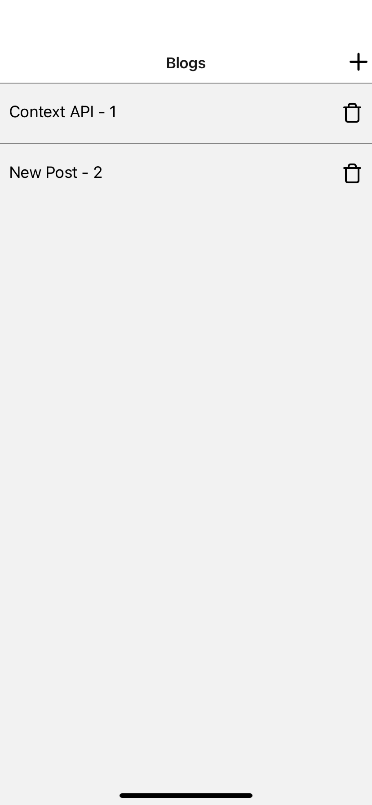
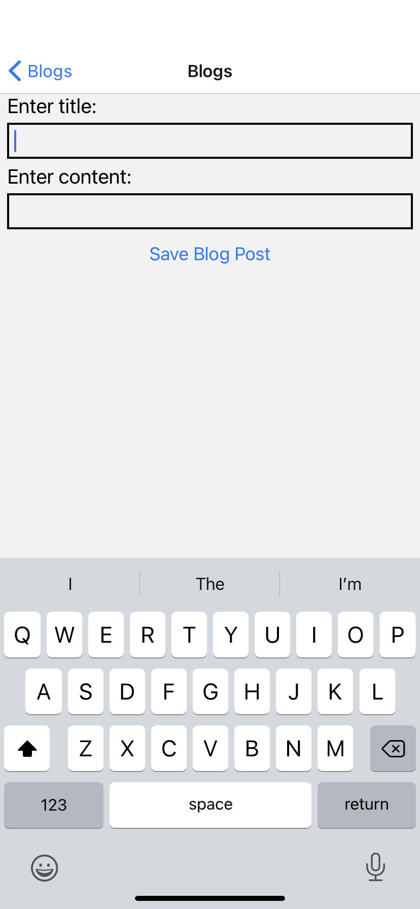
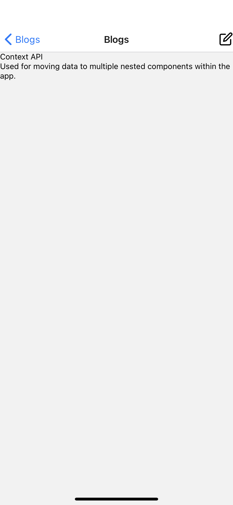
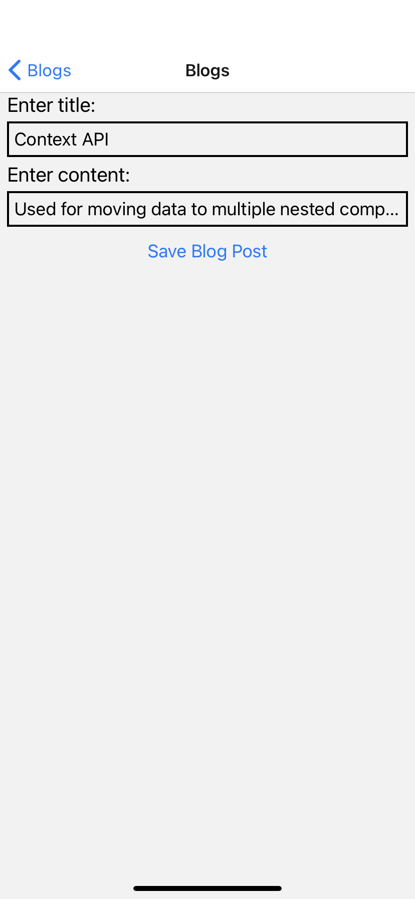

# BlogPost

An app that allows users to create, edit, and delete blog posts, developed with [React Native](https://reactnative.dev/) using its [Context API](https://reactjs.org/docs/context.html).

## Setup

1. Install the [expo-cli](https://github.com/expo/expo-cli) globally using [npm](https://www.npmjs.com/get-npm):
````
$ npm install -g expo-cli
````

2. Install the project:
````
$ cd BlogPost && npm install
````

3. Connect the app to its database by launching the [blog-post-server](https://github.com/memonsahil/blog-post-server) project in your IDE and completing its setup.

4. After completing the above step, the app will connect to its database on launch. Start the project:
````
$ expo start
````

## Screenshots

### Index Screen


### Create Screen


### Show Screen


### Edit Screen


## Contributing
Pull requests are welcome. For major changes, please open an issue first.

## License
MIT &copy; [memonsahil](https://github.com/memonsahil)
